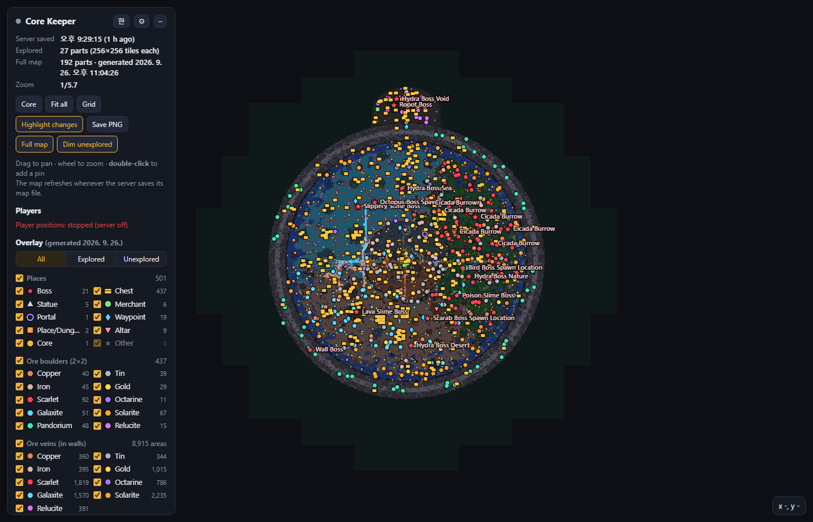

# Core Keeper 맵 뷰어

**Core Keeper 전용 서버(Dedicated Server)** 의 탐험 지도를 브라우저에서 실시간으로 보는 로컬 웹 지도입니다.
원하면 **월드 전체를 미리 생성한 지도**(보스·상자·상인·광석 위치 포함)와 **플레이어 실시간 위치**도 함께 볼 수 있습니다.

[English README](README.md)



- **탐험 지도 실시간 표시** — 전용 서버가 저장하는 지도 파일(`servermaps/<월드>.mapparts.gzip`)을 읽고,
  바뀐 조각만 브라우저로 보냅니다.
- **전체 지도 (선택)** — 서버 복사본으로 월드 *전체*를 오프라인 생성해 탐험 지도 아래에 어둡게 깔아 줍니다.
  보스·상자·석상·상인·포탈·웨이포인트·던전·제단·광석 덩어리·광맥 위치 표시, "탐험한 곳만 / 안 가본 곳만" 필터.
- **플레이어 위치 (선택)** — 작은 읽기 전용 서버 모드가 1초마다 위치를 기록하고, 뷰어가 이름·체력 막대와 함께
  보여 줍니다. "따라가기" 가능.
- 공유 핀(더블클릭), PNG 저장, 위치 링크(`?at=x,y,배율`), 한국어/영어 화면.
- 모두 내 PC 안에서 동작합니다. 계정·업로드·인터넷 연결 필요 없음.

> 앱은 Windows 전용입니다. 서버는 어디서 돌아도 됩니다 — [리눅스/도커 서버](#리눅스--도커-서버) 참고.

## 설치

1. [Releases](../../releases) 페이지에서 `CoreKeeperMapViewer-vX.Y.Z-windows.zip` 을 받습니다.
2. 아무 폴더에나 압축을 풉니다 (예: `문서\CoreKeeperMapViewer`).
3. `CoreKeeperMapViewer.exe` 실행 → 콘솔 창(로그)이 뜨고 브라우저가 `http://127.0.0.1:8765` 를 엽니다.
   끄려면 콘솔 창을 닫으세요.

처음 실행하면 서버를 자동으로 찾습니다. 빠진 것이 있으면 **⚙ 설정** 창이 열리고 찾은 결과를 보여 줍니다.

| 항목 | 자동 감지 방법 |
|---|---|
| 전용 서버 설치 폴더 (`CoreKeeperServer.exe`) | Steam 레지스트리(`HKCU\Software\Valve\Steam` → `SteamPath`, `HKLM\SOFTWARE\WOW6432Node\Valve\Steam` → `InstallPath`) → `steamapps\libraryfolders.vdf` 의 모든 라이브러리 → `appmanifest_1963720.acf` (*Core Keeper Dedicated Server*) |
| 서버 데이터 폴더 | `%USERPROFILE%\AppData\LocalLow\Pugstorm\Core Keeper\DedicatedServer` |
| 월드 | 그 폴더의 `ServerConfig.json` 에 있는 `"world"` |

설정 창에서 각각 직접 바꿀 수 있습니다. 설정은 `%APPDATA%\CoreKeeperMapViewer\config.json`,
핀과 생성된 지도는 `%APPDATA%\CoreKeeperMapViewer\worlds\<월드>-<id>\` 에 저장됩니다.
뷰어는 플레이어 모드의 *설치/제거* 버튼을 누를 때 말고는 서버 데이터 폴더나 설치 폴더에 아무것도 쓰지 않습니다.

서명되지 않은 앱이라 Windows SmartScreen 경고가 뜰 수 있습니다 — *추가 정보 → 실행*, 또는
[소스로 실행](#소스로-실행)하세요.

## 전체 지도 (안 가본 곳 포함)

**⚙ 설정 → 전체 지도 생성.** 진행 상황이 실시간으로 표시됩니다. 대략 10~60분 걸립니다
(반경을 작게 주면 몇 분).

동작 방식과 안전 설계:

1. 설치된 전용 서버를 임시 폴더(`%LOCALAPPDATA%\CoreKeeperMapViewer\fullmap-work`, 약 0.5GB,
   두 번째부터는 바뀐 파일만)로 **복사**합니다.
2. 월드 세이브(와 현재 서버 지도)를 별도 임시 데이터 폴더로 **복사**합니다.
   `ServerConfig.json`(게임 ID·비밀번호가 들어 있음)은 복사하지 않습니다.
3. 동봉된 **FullMapGen** 모드를 **복사본에만** 넣고(복사본의 다른 모드는 제거), `ARMED` 표시 파일을 둡니다.
   무작위 포트·무작위 게임 ID·비밀번호·최대 1인으로 일회용 서버를 띄웁니다.
4. 모드는 플레이어가 탐험할 때 게임이 쓰는 것과 같은 방식으로 구역별 지형을 생성하고, 게임 지도와 같은 색으로
   서버 지도에 그린 뒤, 주요 위치 목록을 내보냅니다.
5. 뷰어는 **자기가 띄운 프로세스만**(PID 기준) 종료합니다. 이 프로세스는 Windows 작업 개체(Job Object)에도
   묶여 있어 뷰어보다 오래 살아남을 수 없습니다. 결과는 앱 데이터 폴더로 가져옵니다.

모드 안전장치 — **모두** 맞아야만 동작하고, 하나라도 아니면 완전히 아무것도 하지 않습니다:
`-datapath` 가 명시적으로 주어졌고, 그 경로가 기본(실제) 서버 데이터 경로가 *아니고*, 올바른 토큰이 든
`ARMED` 파일이 있을 것. 플레이어나 네트워크 연결이 생기는 즉시 중단합니다.
생성하는 동안 실제 서버는 계속 켜 둬도 됩니다. 실제 파일은 읽기만 합니다.

참고: 같은 시드와 게임 자체 생성기로 만들지만, 일부 구조물 배치는 나중에 실제 서버가 생성할 모습과 조금 다를 수
있습니다. 큰 게임 업데이트 뒤에는 다시 생성하세요.

## 플레이어 실시간 위치 (LivePlayers 모드)

**⚙ 설정 → 플레이어 위치 모드 → 설치 / 업데이트** 후 **전용 서버를 다시 시작**하세요.

- 그 설치 폴더의 `CoreKeeperServer.exe` 가 실행 중이면 버튼이 거부합니다(모드는 서버 시작 때 컴파일됨).
  서버 끄기 → 설치 → 서버 켜기. 서버 로그(`CoreKeeperServerLog.txt`)에 `[LivePlayers] v1.0.0 loaded` 가 보이면 정상.
- **서버 전용**: 매니페스트가 `requiredOn: 0` — 플레이어는 모드 없는 일반 게임으로 그대로 접속합니다.
- **읽기 전용**: 플레이어 엔티티(이름·위치·체력·사망 여부)를 읽기만 합니다. 엔티티 쓰기·Harmony 패치
  (`disableHarmonyPatching: true`)·네트워크 메시지 없음. 파일 쓰기는 별도 스레드에서 하고, 오류는 잡아서 한 번만 기록합니다.
- 출력: `<데이터 폴더>\mods\LivePlayers\players.json`, 약 1초마다(접속자가 없어 서버가 쉬는 동안은 2초마다).
- 제거도 같은 방법(*제거* 후 서버 재시작).

## 같은 네트워크(LAN)에서 보기

설정 → *같은 네트워크(LAN)의 다른 기기에서도 보기* 를 켜면 `127.0.0.1` 대신 `0.0.0.0`(모든 네트워크 카드)으로
엽니다. 설정 창에 휴대폰·태블릿·다른 PC에서 열 주소가 표시됩니다.

- **로그인 기능이 없습니다.** 포트에 접근할 수 있는 누구나 지도(플레이어 이름·위치 포함)를 보고 공유 핀을 추가/삭제할 수 있습니다.
- 설정 변경·지도 생성·모드 설치/제거는 **뷰어를 실행한 PC에서만** 받습니다(루프백 주소 + Host 검사 + 전용 헤더).
- Windows 방화벽으로 제한하세요: 방화벽이 물으면 *개인 네트워크* 만 허용하거나, 뷰어 TCP 포트에 대해
  로컬 서브넷/특정 기기만 허용하는 인바운드 규칙을 만드세요. 공유기에서 포트 포워딩은 하지 마세요.

## 리눅스 / 도커 서버

뷰어 앱은 Windows 전용이지만, 서버 데이터 폴더에서 **읽기 권한**만 있으면 되는 파일은 두 개뿐입니다:

- `servermaps/<월드>.mapparts.gzip` (탐험 지도)
- `mods/LivePlayers/players.json` (그 서버에 LivePlayers 모드를 넣은 경우만)

서버 데이터 폴더를 Windows PC에 연결(SMB 공유/네트워크 드라이브, 동기화 폴더, 주기적 복사)하고 설정의
*서버 데이터 폴더* 로 지정하세요. 리눅스 서버에 LivePlayers 를 쓰려면 이 저장소의 `ckmapviewer/mods/LivePlayers` 를
서버의 `CoreKeeperServer_Data/StreamingAssets/Mods/` 에 직접 복사하세요(서버 끈 상태). 전체 지도 생성에는 Windows에
설치된 무료 *Core Keeper Dedicated Server*(Steam)와, 지정한 데이터 폴더 안의 월드 세이브 사본이 필요합니다.

## 한계

- "실시간" 탐험 지도: 게임 서버가 지도 파일을 몇 분에 한 번만 저장하므로 그만큼 늦게 나타납니다.
  플레이어 위치(모드 사용 시)는 1초마다 갱신됩니다.
- 전체 지도는 복사본으로 만든 스냅숏이라 실제 서버가 나중에 생성할 모습과 조금 다를 수 있고, 플레이어가 파거나
  지은 변화는 반영되지 않습니다. 위에 겹치는 탐험 지도는 항상 실제 최신 지도입니다.
- 앱은 Windows 전용. Steam 전용 서버로 시험했습니다. 게임 업데이트로 모드가 동작하지 않게 될 수 있습니다
  (그 경우 모드는 오류를 기록하고 멈추며, 뷰어 자체는 계속 동작합니다).

## 문제 해결

| 증상 | 해결 |
|---|---|
| "서버 지도 파일이 없습니다" | 설정에서 *서버 데이터 폴더* 와 *월드* 확인. 서버를 한 번 실행해 저장되면 파일이 생깁니다. |
| 설치 폴더 "없음" | `CoreKeeperServer.exe` 가 있는 폴더를 직접 입력하세요. |
| 모드 설치 때 "실제 서버 실행 중" | 전용 서버를 먼저 끄고 설치한 뒤 다시 켜세요. |
| 플레이어 위치: "모드 미설치" | 모드 설치 후 서버 재시작. 서버 로그에 `[LivePlayers] ... loaded` 확인. |
| 플레이어 위치: "멈춤" | 서버가 꺼졌거나 모드가 기록을 멈춤(서버 로그 확인). |
| 전체 지도 생성 실패 | 설정 창 로그에 단계가 나옵니다. 일회용 서버 로그는 월드 앱 데이터 폴더(*열기*)의 `fullmap-last-server.log` 로 남습니다. |
| 포트 사용 중 | 다른 프로그램이 8765 를 씀 — 설정에서 *포트* 를 바꾸거나 `--port 8766` 으로 실행. |
| 브라우저가 안 열림 | `http://127.0.0.1:8765` 를 직접 여세요. exe를 다시 실행하면 브라우저만 엽니다. |

명령줄(소스 실행도 동일): `CoreKeeperMapViewer.exe [--port N] [--lan] [--data-dir 경로]
[--server-install 경로] [--world N] [--no-browser]`, 그리고 `detect`, `generate [--radius N]`,
`mod install|uninstall|status`.

## 소스로 실행

Python 3.9+ 필요(표준 라이브러리만 사용):

```
py app.py                 # 또는 py -m ckmapviewer, 또는 start-from-source.bat
py app.py detect          # 자동 감지 결과 출력
py -m unittest discover -s tests
```

Windows 앱 빌드: `build.bat` (`.venv` 생성 → PyInstaller 설치 → 테스트 → `dist\CoreKeeperMapViewer\` 와 zip 생성).
`v*` 태그를 올리면 GitHub Actions 가 빌드해서 릴리스에 올립니다.

## 출처 / 고지

- 지도 파일 형식: [Ceddini/CoreKeeperMapTool](https://github.com/Ceddini/CoreKeeperMapTool),
  [SomniferousWallaby/CoreKeeperMapServer](https://github.com/SomniferousWallaby/CoreKeeperMapServer)
- 모드는 게임의 공식 모딩 API(PugMod)와 공개된 게임 타입만 사용합니다. 이 저장소에는 게임 코드나 에셋이 없습니다.

Core Keeper 는 Pugstorm 이 개발하고 Fireshine Games 가 배급한 게임입니다. 이 프로젝트는 팬이 만든 도구이며
**Pugstorm·Fireshine Games 와 관련이 없고 보증받지 않았습니다**.

라이선스: [MIT](LICENSE).
